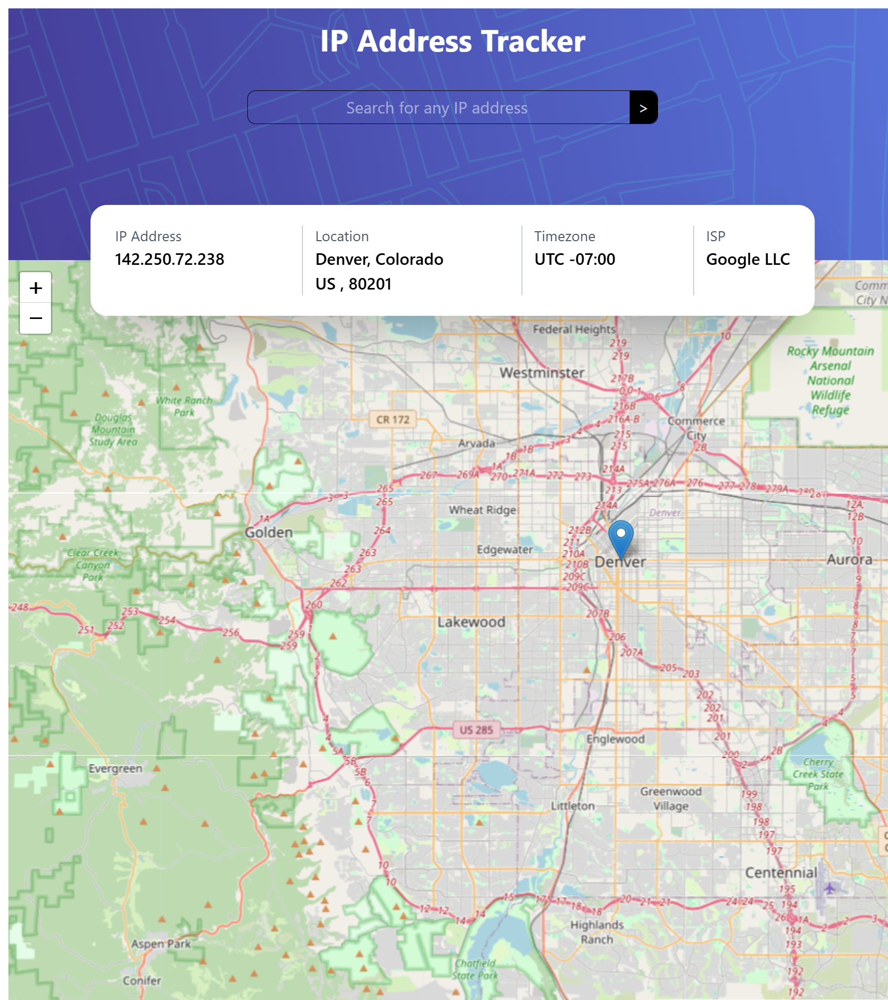

# IP Address Tracker (React Version)

This is my React-based solution to the IP Address Tracker challenge on Frontend Mentor. The application is a single-page interface that displays detailed information about an IP address or domain name, including its location, time zone, and ISP. When the page loads, the app automatically fetches and displays data for the user’s own IP address.

Users can enter any IP address or domain into the search field, and the page will update the displayed information accordingly. A dynamic Leaflet map re-centers based on the fetched coordinates, and a loading Spinner component ensures a smooth experience while data is being retrieved. The UI combines a SearchInput, interactive MapComponent, and an information Banner, all connected inside the main App component for clean structure and maintainability. Here is a [link](https://ip-address-tracker-at.netlify.app/) to the website deployed on Netlify.

## Core Features

### Input Validation

All user inputs are validated before triggering an API request, ensuring that only properly formatted IP addresses or domain names are processed. Invalid inputs return a clear error state and prevent unnecessary network calls.

### Data Fetching

The app fetches geolocation data both on initial load and on each user search. API interactions are cleanly abstracted, allowing the UI to update seamlessly based on whichever data was retrieved.

### Application Integration

The App component coordinates all application logic—validating input, fetching data, and rendering UI elements. The SearchInput, Banner, MapComponent, and Spinner components work together to create a fully responsive and intuitive user experience.

## Author
Aram Torosyan